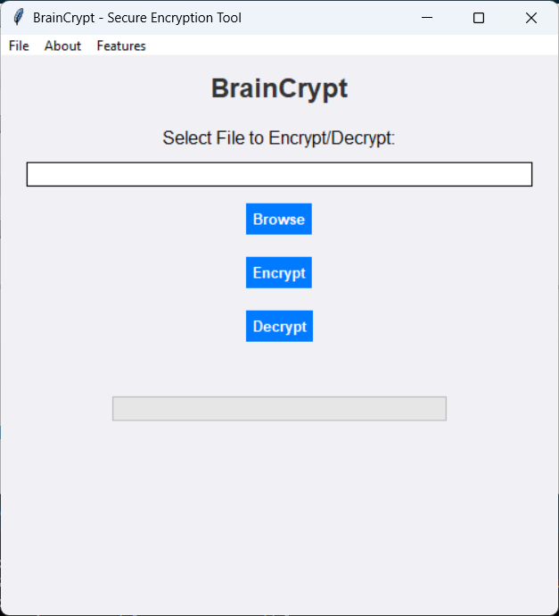
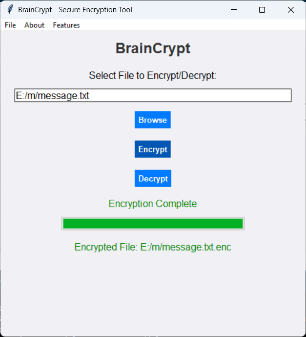
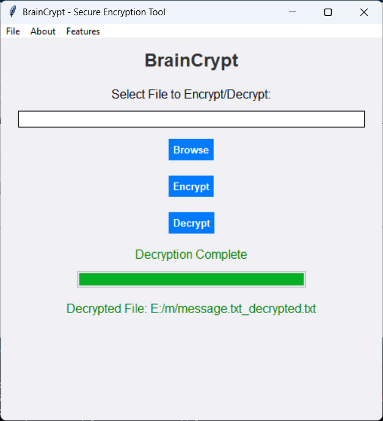

# 🔐 BrainCrypt - Secure File Encryption Tool

🔐BrainCrypt is a **real-world encryption and decryption tool** using **AES-GCM** for secure and authenticated encryption. It provides a **user-friendly GUI** built with Tkinter and supports **smooth, multi-threaded encryption and decryption**.

---

## 🚀 Features

✅ **AES-GCM Encryption** – Ensures secure and authenticated encryption.  
✅ **Human-Readable Decryption** – Proper handling of text files for readable output.  
✅ **Multi-Threaded Execution** – UI remains responsive while encrypting/decrypting.  
✅ **Progress Bar Integration** – Real-time status updates.  
✅ **Automatic Key Handling** – The encryption key is securely stored inside the file.  
✅ **Cross-Platform Support** – Works on **Windows, Linux, and macOS**.

---

## 📥 Installation

### 1️⃣ **Clone the Repository**
```sh
git clone https://github.com/shiboshreeroy/BrainCrypt.git
cd BrainCrypt
```

### 2️⃣ **Install Required Libraries**
Ensure you have Python 3.7+ installed. Install dependencies using:
```sh
pip install -r requirements.txt
```

> **Dependencies**
> - `cryptography` – Provides AES-GCM encryption.
> - `tkinter` – GUI framework for the application.
> - `tqdm` – Provides a progress bar.
> - `secrets` – Secure random key generation.
> - `logging` – Logs program execution details.

---

## 🎯 Usage

### **Run the GUI**
Start the application by running:
```sh
python braincrypt.py
```

### **Encrypt a File**
1️⃣ Open the application.  
2️⃣ Click **Browse** and select a text file (e.g., `message.txt`).  
3️⃣ Click **Encrypt**.  
4️⃣ A new file `message.txt.enc` will be created.

### **Decrypt a File**
1️⃣ Select the encrypted file (`message.txt.enc`).  
2️⃣ Click **Decrypt**.  
3️⃣ The decrypted file `message_decrypted.txt` will be generated.

---

## 🔧 How It Works

### **AES-GCM Encryption**
- **AES (Advanced Encryption Standard)** is a widely used encryption algorithm.
- **GCM (Galois/Counter Mode)** ensures both **confidentiality and integrity**.
- **IV (Initialization Vector)** is randomly generated to ensure security.

### **Key Handling**
- A **random 16-byte key** is generated and stored inside the encrypted file.
- The key is extracted during decryption to ensure seamless recovery.

### **Multi-Threading**
- Uses Python's `threading` module to **prevent UI freezing** while encrypting/decrypting.
- This ensures a **smooth user experience**.

---

## 🖥️ Screenshots

### **Main GUI**


### **Encryption in Progress**


### **Decryption Completed**


---

## 📚 Resources & Documentation

🔹 **Python Cryptography Library**  
   [https://cryptography.io/en/latest/](https://cryptography.io/en/latest/)  

🔹 **AES Encryption Guide**  
   [https://www.nist.gov/publications/advanced-encryption-standard-aes](https://www.nist.gov/publications/advanced-encryption-standard-aes)  

🔹 **Tkinter GUI Programming**  
   [https://realpython.com/python-gui-tkinter/](https://realpython.com/python-gui-tkinter/)  

🔹 **Threading in Python**  
   [https://docs.python.org/3/library/threading.html](https://docs.python.org/3/library/threading.html)  

---

## 📌 Future Improvements

🔹 **Support for Binary Files** (PDFs, images, etc.)  
🔹 **Password-based Encryption (PBKDF2)**  
🔹 **Drag-and-Drop File Support**  

---

## 🛠️ Contributing

1️⃣ Fork the repository.  
2️⃣ Create a new branch (`feature-xyz`).  
3️⃣ Commit your changes.  
4️⃣ Push the branch and create a Pull Request.

---

## 📝 License

**MIT License** - You are free to use, modify, and distribute this software.

---

## 💬 Support & Contact

📧 Email: **your.email@example.com**  
🐙 GitHub: **[@yourusername](https://github.com/yourusername)**  
```

---

### **🔹 Additional Resources**
If you want to improve BrainCrypt further, here are some useful references:

1. **AES-GCM Implementation**:  
   [https://cryptography.io/en/latest/hazmat/primitives/symmetric-encryption/#authenticated-encryption-modes](https://cryptography.io/en/latest/hazmat/primitives/symmetric-encryption/#authenticated-encryption-modes)

2. **Python Multithreading**:  
   [https://realpython.com/intro-to-python-threading/](https://realpython.com/intro-to-python-threading/)

3. **Best Practices for Secure Encryption**:  
   [https://owasp.org/www-community/Using_the_Right_Encryption_Algorithm](https://owasp.org/www-community/Using_the_Right_Encryption_Algorithm)

---

This **README.md** makes BrainCrypt look **professional and ready for deployment**! 🚀 Let me know if you want to add anything else. 😊